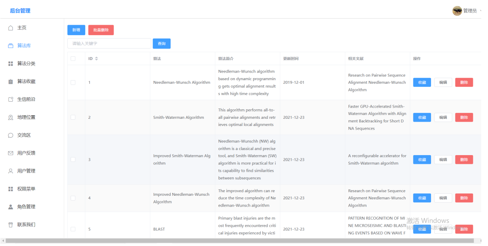
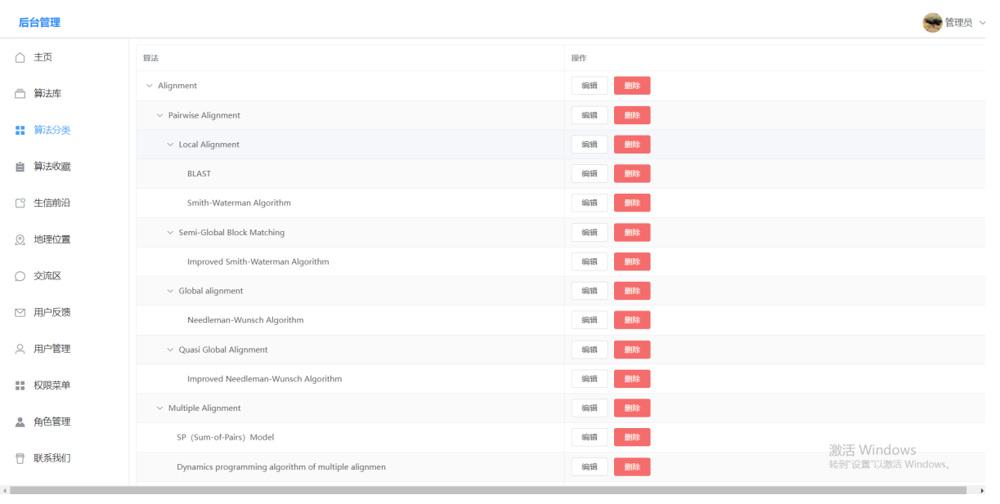
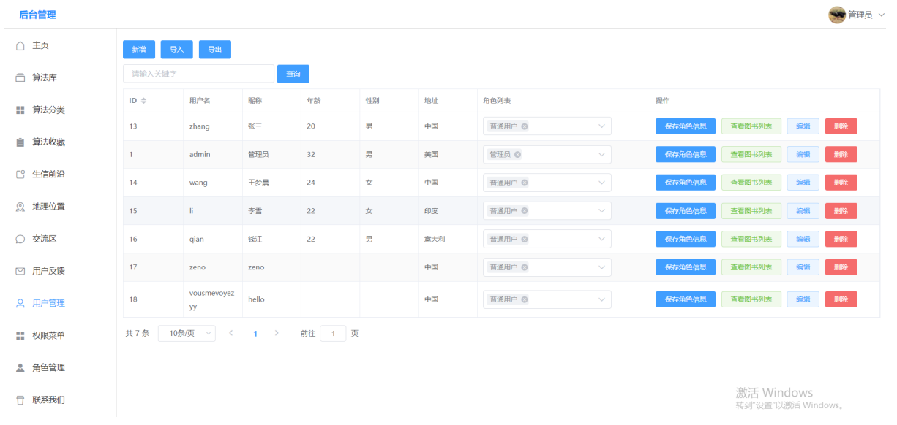

# SZZS/SpringBoot+Vue

当前最新版本： 0.1.1（发布日期：2021-12-12）


## 介绍

SZZS，是一款面向生物信息学相关研究工作者的生物信息学基本知识管理系统，采用前后端分离架构：SpringBoot，Mybatis-Plus，Axios&Vue，Vue-Router，Vuex，ElementUI。项目基于多年来生物信息学的发展历程，由本组成员对算法、科研文献等领域的数据进行整合和设计；产品满足了用户登录、权限分配、分类查询、在线聊天等功能，可以满足用户灵活多样的个性化的管理需求。

前端：Vue，Vue-Router，VueX，Axios，ElementUI

后台：SpringBoot，Mybatis-Plus


## 功能清单

- 登录注册
- 基于RBAC的权限模型（可分配角色和菜单权限）
- 单表增删改查（包括分页模糊查询）
- 登录验证码
- 文件上传
- 导入导出
- 服务器部署
- 富文本编辑器
- 树形表格（数据可作为树形菜单使用）
- JWT权限
- 后端1对多查询
- 批量删除
- 百度地图
- 在线聊天室
- 在线留言
- 个人头像
- 整合Echarts图表
- 微信、支付宝沙箱支付
- SpringSecurity密码加密验证


## 技术架构

### 开发环境

- 语言：Java 8
- IDE(JAVA)： IDEA / Eclipse，安装lombok插件
- IDE(前端)： IDEA / WebStorm
- 依赖管理：Maven
- 数据库：MySQL5.7+ & Oracle 11g & SqlServer2017
- 缓存：Redis

### 后端

- 基础框架：Spring Boot 2.1.3.RELEASE
- 持久层框架：Mybatis-plus_3.1.2
- 安全框架：Apache Shiro 1.4.0，Jwt_3.7.0
- 数据库连接池：阿里巴巴Druid 1.1.10
- 缓存框架：redis
- 日志打印：logback
- 其他：fastjson，poi，Swagger-ui，quartz, lombok（简化代码）等

### 前端

- [Vue 3.2.4](https://gitee.com/link?target=https%3A%2F%2Fcn.vuejs.org%2F),[Vuex](https://gitee.com/link?target=https%3A%2F%2Fvuex.vuejs.org%2Fzh%2F),[Vue Router](https://gitee.com/link?target=https%3A%2F%2Frouter.vuejs.org%2Fzh%2F)
- [Axios](https://gitee.com/link?target=https%3A%2F%2Fgithub.com%2Faxios%2Faxios)
- [ant-design-vue](https://gitee.com/link?target=https%3A%2F%2Fvuecomponent.github.io%2Fant-design-vue%2Fdocs%2Fvue%2Fintroduce-cn%2F)
- [webpack](https://gitee.com/link?target=https%3A%2F%2Fwww.webpackjs.com%2F),[yarn](https://gitee.com/link?target=https%3A%2F%2Fyarnpkg.com%2Fzh-Hans%2F)
- [vue-cropper](https://gitee.com/link?target=https%3A%2F%2Fgithub.com%2Fxyxiao001%2Fvue-cropper) - 头像裁剪组件
- [@antv/g2](https://gitee.com/link?target=https%3A%2F%2Fantv.alipay.com%2Fzh-cn%2Findex.html) - Alipay AntV 数据可视化图表
- [Viser-vue](https://gitee.com/link?target=https%3A%2F%2Fviserjs.github.io%2Fdocs.html%23%2Fviser%2Fguide%2Finstallation) - antv/g2 封装实现
- eslint，[@vue/cli 3.2.1](https://gitee.com/link?target=https%3A%2F%2Fcli.vuejs.org%2Fzh%2Fguide)
- vue-print-nb - 打印


## 后台开发环境和依赖

- java
- maven
- jdk 1.8
- mysql 5.7
- redis
- 初始系统管理员： admin/123456


## 前端开发环境和依赖

- node: 官网最新稳定版
- yarn
- webpack
- eslint
- @vue/cli 3.2.1
- [ant-design-vue](https://gitee.com/link?target=https%3A%2F%2Fgithub.com%2FvueComponent%2Fant-design-vue) - Ant Design Of Vue 实现
- [vue-cropper](https://gitee.com/link?target=https%3A%2F%2Fgithub.com%2Fxyxiao001%2Fvue-cropper) - 头像裁剪组件
- [@antv/g2](https://gitee.com/link?target=https%3A%2F%2Fantv.alipay.com%2Fzh-cn%2Findex.html) - Alipay AntV 数据可视化图表
- [Viser-vue](https://gitee.com/link?target=https%3A%2F%2Fviserjs.github.io%2Fdocs.html%23%2Fviser%2Fguide%2Finstallation) - antv/g2 封装实现
- [jeecg-boot-angular 版本](https://gitee.com/dangzhenghui/jeecg-boot)


## 如何使用

后台：maven导入springboot工程，然后配置数据库，启动后台

前台：进入vue文件夹，执行命令：

```
npm install
npm run serve
```

即可启动前台vue工程


## 系统效果

### 算法库




### 分类管理




### 用户管理




## 注意事项

> 1. 数据库的字段设计要以下划线分割，而不是驼峰，例如 可以使用 your_id 而不要使用 yourId，字段设计的名称一定要规范。
> 2. 不要使用单个字母作为分割的一部分，例如：不要使用 u_id，而推荐你使用user_id。
> 3. 数据库多表关联查询推荐使用单独的VO来做扩展，尽量不要改动数据库映射的entity，比如你可以加一个类UserVO来扩充一些字段，而不是在User实体里面扩展。
> 4. 如果非要在User实体里面扩展，你需要加上 @TableField(exist=false) 来表示这个字段在数据库不存在，否则会报错。
> 5. 日期字段的格式化，需要使用 @JsonFormat(pattern = "yyyy-MM-dd", timezone = "GMT+8") 注解来做日期解析，可以参考Book实体里面的createTime字段。

